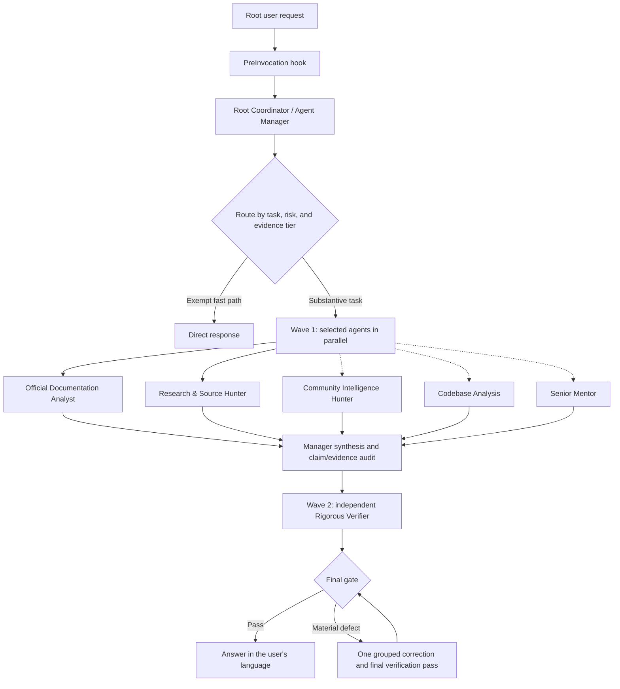

# Antigravity Adaptive Two-Wave Team

An experimental, adaptive multi-agent orchestration plugin for Google Antigravity. It discovers specialized agent profiles, routes only the agents relevant to the request, runs research and analysis in parallel, and uses a separate verifier before publishing material results.

> [!IMPORTANT]
> This is an independent community project for testing and development. It is not an official Google product, is not affiliated with or endorsed by Google, and is not production-certified. Review its instructions, permissions, evidence, and generated output before relying on it.

## Why this project exists

Fixed teams are easy to understand but expensive to run: a greeting should not launch five researchers, while a current-version investigation should not be answered from an old static guide. This project was created to provide a more proportional workflow:

- Use a fast path for greetings, acknowledgements, formatting, and purely creative requests.
- Treat current, latest, version, release, support, and deprecation questions as live research.
- Select official and independent research lanes by default for substantive factual work.
- Add community, codebase, or senior-review specialists only when they own part of the task.
- Discover future agent profiles automatically instead of maintaining a hardcoded registry.
- Stop research when the configured evidence target is satisfied.
- Keep verification policy in the root manager while preserving an independent Wave 2 verifier.
- Reject simulated agents, unsupported claims, domain-only citations, and unverifiable local-state claims.

The goal is not to maximize the number of agents. It is to use the smallest qualified team that can produce a current, traceable, and independently checked result.

## How it works



Dashed Wave 1 branches are conditional. The official-documentation and independent-research profiles are the default evidence lanes for substantive factual work; they are not required for configured fast-path requests.

## Included agents

| Profile | Activation | Responsibility |
|---|---|---|
| `official-documentation-analyst` | Default evidence | Current first-party documentation, releases, support, standards, and advisories |
| `rsh-current-research` | Default evidence | Independent technical research, original sources, and contradiction analysis |
| `community-intelligence-hunter` | Conditional | Developer reports from GitHub, Reddit, Stack Overflow, X, Linux.do, and other communities |
| `codebase-analysis` | Conditional | Workspace, code, configuration, dependencies, tests, and local state |
| `senior-mentor` | Conditional | Architecture, best practices, risk, trade-offs, and recommendations |
| `rigorous-verifier` | Wave 2 | Independent falsification, citation audit, and acceptance verification |

Every agent profile is read-only and cannot create additional subagents. The root Antigravity agent remains the coordinator and owns the final response.

## Repository structure

```text
.
|-- plugin.json                         # Antigravity plugin manifest
|-- hooks.json                          # PreInvocation hook registration
|-- orchestration/
|   |-- team.json                       # Routing, budgets, waves, and final gates
|   |-- schemas/                        # Team and agent JSON schemas
|   `-- agents/<agent-id>/
|       |-- agent.json                  # Discoverable profile and routing metadata
|       `-- SYSTEM.md                   # Specialized system prompt
|-- rules/                              # Global coordinator and evidence policies
|-- skills/                             # Reusable Antigravity skills
|-- scripts/mandatory-agent-reminder.ps1
|-- tests/run-tests.ps1
`-- .github/workflows/validate.yml
```

## Compatibility

| Surface | Current status | Installation method |
|---|---|---|
| Antigravity Desktop on Windows | Primary test target | Global or workspace plugin folder |
| Antigravity IDE on Windows | Experimental | Workspace/global discovery; verify in Customizations |
| Antigravity CLI on Windows | Experimental | `agy plugin install <path>`; verify with `agy plugin list` and `/hooks` |
| macOS and Linux | Not currently supported by this release | The hook hardcodes `powershell.exe` and needs a portable shell implementation |

The plugin does not bundle an MCP server and does not grant extra system permissions. Tool access still depends on the Antigravity surface, model, sandbox, workspace, and user-approved permission policy.

## Requirements

- Windows with Windows PowerShell 5.1 available as `powershell.exe`.
- A current Google Antigravity installation with plugin and hook support.
- Antigravity CLI (`agy`) only if testing the CLI integration.
- Git only if cloning the repository instead of downloading an archive.

Before installation, inspect at least `plugin.json`, `hooks.json`, `rules/`, and `scripts/mandatory-agent-reminder.ps1`.

## Validate the downloaded project

Open PowerShell in the repository root and run:

```powershell
powershell.exe -NoProfile -NonInteractive -ExecutionPolicy Bypass -File .\tests\run-tests.ps1
```

Install only when the command finishes with `FAILED=0`.

## Install in Antigravity Desktop

Antigravity supports global plugins under `~/.gemini/config/plugins/` and workspace plugins under `.agents/plugins/` (or `_agents/plugins/`). Use one method for the first test so that the loaded copy is unambiguous.

### Option A: global installation

1. Close Antigravity.
2. Open PowerShell and set the path to the downloaded repository:

   ```powershell
   $source = "C:\path\to\antigravity-two-wave-team"
   $pluginsRoot = Join-Path ([Environment]::GetFolderPath("UserProfile")) ".gemini\config\plugins"
   $destination = Join-Path $pluginsRoot "antigravity-two-wave-team"

   New-Item -ItemType Directory -Path $destination -Force | Out-Null
   Get-ChildItem -LiteralPath $source -Force |
       Copy-Item -Destination $destination -Recurse -Force
   ```

3. Validate the installed copy:

   ```powershell
   powershell.exe -NoProfile -NonInteractive -ExecutionPolicy Bypass `
       -File "$destination\tests\run-tests.ps1"
   ```

4. Start Antigravity and open **Customizations**.
5. Confirm that the skills labeled **Plugin: antigravity-two-wave-team** appear.
6. Start a new conversation; existing conversations may retain older customization context.

### Option B: workspace-only installation

Use this when the plugin should affect only one project:

```powershell
$source = "C:\path\to\antigravity-two-wave-team"
$workspace = "C:\path\to\your-project"
$destination = Join-Path $workspace ".agents\plugins\antigravity-two-wave-team"

New-Item -ItemType Directory -Path $destination -Force | Out-Null
Get-ChildItem -LiteralPath $source -Force |
    Copy-Item -Destination $destination -Recurse -Force
```

Open that workspace in Antigravity and verify the plugin in **Customizations**. Do not keep both a global and workspace copy enabled while diagnosing a loading problem.

## Test in Antigravity IDE

The IDE integration is experimental because Antigravity builds may expose customization discovery differently.

1. Install the plugin at the workspace path shown above.
2. Open the same workspace in Antigravity IDE.
3. Open **Customizations** and confirm that the plugin skills are visible.
4. Start a new conversation and use the test prompt below.
5. If the build exposes hook inspection, confirm that `mandatory-agent-team-reminder` is enabled.

Visibility in the UI is evidence that definitions were discovered; it is not proof that the hook executed. Use the behavioral checks in the next section as well.

## Install and test with Antigravity CLI

Desktop and CLI use different plugin installation locations. Installing the Desktop copy does not prove that the CLI has staged or enabled its own copy.

From PowerShell:

```powershell
agy plugin install "C:\path\to\antigravity-two-wave-team"
agy plugin list
agy
```

Inside the CLI session, run:

```text
/hooks
```

Confirm that the plugin and its PreInvocation hook are loaded, then use the test prompt below. The CLI manages installed plugins under `~/.gemini/antigravity-cli/plugins/`; edit the source repository and reinstall through `agy plugin install` when testing a new revision.

Useful lifecycle commands:

```powershell
agy plugin disable antigravity-two-wave-team
agy plugin enable antigravity-two-wave-team
agy plugin uninstall antigravity-two-wave-team
```

## First functional test

Start with a narrow request that requires live evidence:

```text
Investigate the latest public version of Google Antigravity as of today.
Distinguish the product generation from Desktop/IDE, CLI, and SDK component versions.
Use direct official URLs and independent corroboration. Do not simulate agents.
```

Expected behavior:

1. The hook activates once for the root user turn.
2. The manager treats the question as live current-version research, not as a static product-guide lookup.
3. The official-documentation and independent-research agents run as Wave 1.
4. Unrelated codebase or community agents are skipped unless the request needs them.
5. The manager synthesizes claim-level evidence.
6. The independent verifier runs in Wave 2.
7. The final answer states an as-of date, distinguishes components, cites exact pages, and reports material limitations.

For a fast-path control test, send only `hello`. No research team should be launched.

## Configuration

The main behavior is configured in `orchestration/team.json`:

- `routing`: default evidence lanes, fast-path exemptions, specialist selection, and verifier policy.
- `budgets.tiers`: proportional evidence targets for fast, light, standard, and deep requests.
- `executionPolicy`: batched discovery, parallel inspection, direct-source priority, and early stopping.
- `publicationPolicy`: direct-link recovery and unsupported-claim removal.
- `failurePolicy`: bounded verification and explicit failure markers.
- `finalGate`: requirements that must pass before publication.

Do not relax a final gate only to make a failing test pass. First determine whether the defect is in the configuration, implementation, agent report, evidence, or test.

## Adding another specialist

The runtime discovers valid profiles under `orchestration/agents/*/agent.json`. A new specialist normally requires:

```text
orchestration/agents/<new-agent>/agent.json
orchestration/agents/<new-agent>/SYSTEM.md
```

The profile must use schema version 2, reference installed skills, declare accurate routing metadata, remain read-only and non-delegating, and satisfy the output contract. See [CONTRIBUTING.md](CONTRIBUTING.md) for the complete workflow.

## Security and limitations

- Agent output can still be wrong, incomplete, stale, or influenced by malicious external content.
- Community reports are treated as field signals, not as official proof.
- A direct URL is required for material external claims; a publisher name or bare domain is insufficient.
- Local installation claims require direct runtime evidence.
- Research agents are read-only, but their available read/network tools depend on Antigravity permissions.
- The hook uses PowerShell and has only been designed and automatically tested for Windows in this release.
- The plugin increases token and latency costs for substantive tasks, even with adaptive routing and early stopping.
- No orchestration policy can force a model to "think more" or guarantee correctness. This project improves process, evidence discipline, routing, and verification.

Use a sandbox and least-privilege settings when evaluating unfamiliar repositories or external content. Never provide secrets, credentials, or production access solely because an agent requests them.

## Troubleshooting

### Skills appear, but the team does not run

- Start a new conversation after installing or updating the plugin.
- Verify that `hooks.json` and `scripts/mandatory-agent-reminder.ps1` exist in the installed copy.
- Run the test suite against the installed copy.
- In CLI, inspect `/hooks`.
- Confirm that PowerShell execution is available and that Antigravity did not block the hook command.

### Every request launches many agents

Check `routing.fastPathExemptions`, profile routing metadata, and the injected routing decision. Conditional profiles should run only when they own an acceptance criterion or material risk.

### Research is slow

Use a narrower request, keep the evidence tier proportional, and inspect `executionPolicy` and `budgets.tiers`. Do not remove the verifier for current factual or other material tasks merely to hide latency.

### The final result reports a failure marker

- `MANDATORY_TEAM_NOT_EXECUTED`: a selected agent or required verifier did not execute.
- `FINAL_VERIFICATION_FAILED`: executions completed, but the bounded correction process did not obtain an allowed verdict.

These markers are intentional fail-closed behavior; they should not be replaced with simulated success.

## Updating or uninstalling

For Desktop or IDE, close Antigravity, replace the installed plugin files with the new tested revision, reopen the application, and start a new conversation. For CLI, reinstall from the updated source path with `agy plugin install` and verify using `agy plugin list` and `/hooks`.

To uninstall a manual Desktop/workspace installation, close Antigravity and remove only the exact `antigravity-two-wave-team` directory that you installed. For CLI, use:

```powershell
agy plugin uninstall antigravity-two-wave-team
```

## Official Antigravity references

- [Desktop plugin installation and structure](https://www.antigravity.google/docs/plugins)
- [CLI plugin installation and lifecycle](https://antigravity.google/docs/cli-plugins)
- [Antigravity CLI installation](https://antigravity.google/docs/cli-install?hl=en)
- [Hooks and `PreInvocation`](https://antigravity.google/docs/hooks)
- [Skills and progressive disclosure](https://antigravity.google/docs/skills)

## Contributing

Development setup, architecture invariants, agent creation, testing, and pull-request requirements are documented in [CONTRIBUTING.md](CONTRIBUTING.md).

## License

No open-source license has been selected yet. Before broad public distribution or accepting external contributions, the repository owner should add an explicit `LICENSE` file. Until then, normal copyright restrictions apply.
